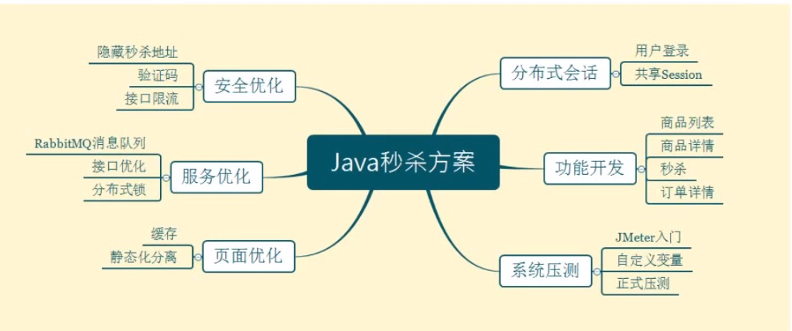

# 秒杀



1. 自定义注解进行参数校验

   ```xml
           <!--  validation组件 -->
           <dependency>
               <groupId>org.springframework.boot</groupId>
               <artifactId>spring-boot-starter-validation</artifactId>
           </dependency>
   ```

   ```java
   		@RequestMapping("/doLogin")
       @ResponseBody
       public RespBean doLogin(@Valid LoginVo loginVo){//添加@Valid注解（javax包下）
           log.info("{}", loginVo);
           return userService.doLogin(loginVo);
       }
   ```

   ```java
   public class LoginVo {
       @NotNull
       @IsMobile//自定义验证注解
       private String mobile;
   
       @NotNull
       @Length(min = 32)
       private String password;
   }
   ```

   自定义验证注解

   IsMobile.java

   IsMobileValidator.java

   

2. 异常处理

GlobalException.java和GlobalExceptionHandler.java配合@RestControllerAdvice注解使用


3. session

   CookieUtils.java 生成session

   UUIDUtils.java 设置session

   应用部署在多台服务器时：分布式session

   方案一：session复制

   方案二：前端存储

   方案三：session粘滞

   方案四：后端集中存储

   

   采用SpringSession

   · 添加依赖

   ```xml
           <dependency>
               <groupId>org.springframework.boot</groupId>
               <artifactId>spring-boot-starter-data-redis</artifactId>
           </dependency>
           <dependency>
               <groupId>org.apache.commons</groupId>
               <artifactId>commons-pool2</artifactId>
           </dependency>
           <dependency>
               <groupId>org.springframework.session</groupId>
               <artifactId>spring-session-redis</artifactId>
           </dependency>
   ```

   · 配置redis

   ```yaml
    redis:
       host: 120.27.149.243
       port: 63796
       #操作的数据库
       database: 0
       password: Zl.mtcldys606910
       #连接超时时间
       timeout: 10000ms
       lettuce:
         pool:
           #最大连接数，默认8
           max-active: 8
           #最大连接阻塞等待时间，默认-1
           max-wait: 10000ms
           #最大空闲连接，默认8
           max-idle: 200
           #最小空闲连接时间，默认0
           min-idle: 5
   ```

   将用户信息存入session

4. 登陆拦截器

   入参的时候判断：HandlerMethodArgumentResolver

   拦截器：intercepter

5. 跨域

6. jemter压测


## 页面缓存

1. ```java
   			//引入redis
   			@Autowired
   			private RedisTemplate redisTemplate;
   
   			@RequestMapping(value = "toList", produces = "text/html;charset=utf-8")
   			@ResponseBody
   
   
           //尝试在redis中获取页面
           ValueOperations valueOperations = redisTemplate.opsForValue();
           String html = ((String) valueOperations.get("goodsList"));
           if(!StringUtils.isEmpty(html)){
               return html;
           }
   ```

## 对象缓存


## 页面静态化

前段不会变的页面静态化